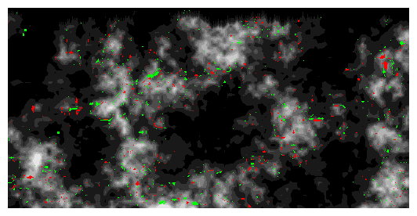

# Heightmap Diff

A command-line Lua tool for detecting and **visualizing changes** between two **heightmap images**.



Primarily intended for OpenTTD heightmap screenshots (e.g. before and after a game session), but can be used for any grayscale terrain data. The output is a **color-highlighted** image showing where land was _raised_ or _lowered_, along with basic statistics.


## Features

- **Generates a visual diff** highlighting raised/lowered terrain two grayscale (or RGB) heightmap images
- **Command-line interface** with positional and optional arguments:
    + `input1` and `input2`: heightmap images to compare
    + Options include setting output filename, custom colors for raised/lowered terrain, and whether to save statistics
- **Uses the IM library** to load and process image files
- **Saves results** to PNG
- Prints and optionally saves **change statistics** to TXT


## Usage

<pre><code><span style="color: #0000cc;">lua </span><span>heightmap_diff.lua</span> <span style="font-weight: bold;">&lt;input1&gt; &lt;input2&gt;</span> <span style="font-weight: bold;"><i>[options]</i></span></code></pre>


### Positional arguments:

- `input1` — First heightmap image (e.g. `start.png`)
- `input2` — Second heightmap image (e.g. `end.png`)

### Optional arguments:

- `o=<output>` or `output=<output>` — Output filename (extension can be omitted, always **PNG**)
- `hi=<R,G,B>` or `high=<R,G,B>` — Color for raised terrain. Format: `(R,G,B)` or `R,G,B` (default: **0,255,0**)
- `lo=<R,G,B>` or `low=<R,G,B>` — Color for lowered terrain. Format: `(R,G,B)` or `R,G,B` (default: **255,0,0**)
- `stats=<true|false>` — Save statistics to a `.txt` file (default: **true**)
- `help` — Show usage info

### Examples:

<pre><code><span style="color: gray;">lua heightmap_diff.lua</span> <b> example/start.png  example/end.png</b>
&nbsp;&nbsp;&nbsp;&nbsp;<span style="color: #546bb2;">-- Run the comparison with default settings.</span>
&nbsp;&nbsp;&nbsp;&nbsp;<span style="color: #546bb2;">-- 'start.png' and 'end.png' in subfolder 'example'.</span>

<span style="color: gray;">lua heightmap_diff.lua</span> <b> start.png  end.png  o=diff</b>
&nbsp;&nbsp;&nbsp;&nbsp;<span style="color: #546bb2;">-- Save output to 'diff.png' and statistics to 'diff.txt'.</span>

<span style="color: gray;">lua heightmap_diff.lua</span> <b> start.png  end.png  high=(0,255,255)  low=255,100,100</b>
&nbsp;&nbsp;&nbsp;&nbsp;<span style="color: #546bb2;">-- Customize raised and lowered land colors.</span>

<span style="color: gray;">lua heightmap_diff.lua</span> <b> start.png  end.png  statistics=false</b>
&nbsp;&nbsp;&nbsp;&nbsp;<span style="color: #546bb2;">-- Disable saving of statistics.</span></code></pre>


**Example content of _diff.txt_:**

```
Summary:
--------
Total tiles      : 131072 
Changed tiles    : 2417 (1.84 %)
 - raised land   : 1285 (0.98 %)
 - lowered land  : 1132 (0.86 %)
Unchanged tiles  : 128655 (98.16 %)
```

See the sample files in the `example/` folder:

- `start.png` — Initial heightmap
- `end.png` — Modified heightmap
- `diff.png` — Output with terrain changes highlighted
- `diff.txt` — Output with basic change statistics


## Dependencies

This script uses the [IM image processing library](https://www.tecgraf.puc-rio.br/im/) (`imlua`), licensed under the terms of the MIT license.<br>
For full copyright notice, go to [Tecgraf Library License](https://www.tecgraf.puc-rio.br/iup/en/copyright.html).

For convenience, a **portable Windows release** is provided in the [Releases](https://github.com/chujo-chujo/heightmap-diff/releases) section.<br>
It includes all required dependencies and does not require installation.


## License

This project is licensed under [CC BY-NC-SA 4.0](https://creativecommons.org/licenses/by-nc-sa/4.0/).
See the [LICENSE](./LICENSE) file for details.
